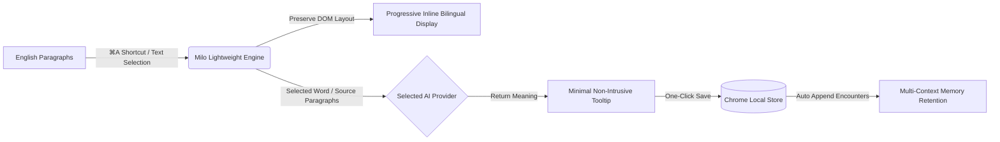
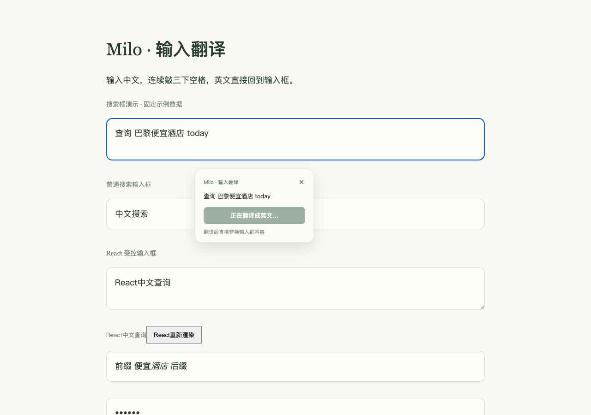
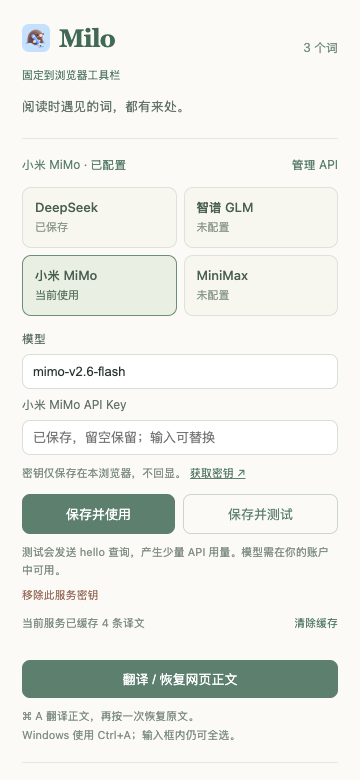

<p align="center"></p>
<h1 align="center">Milo Translator Extension</h1>
<p align="center"><strong>"Translation is the beginning. Keep the words you meet in their native context."</strong></p>
<p align="center">Context-aware progressive AI bilingual reading & vocabulary building Chrome extension</p>
<p align="center">
  <a href="https://github.com/libuyi543-lang/milo-browser-extension/releases/latest">Download Package</a> ·
  <a href="docs/INSTALL.md">Installation Guide</a> ·
  <a href="README.md">中文文档</a> ·
  <a href="https://github.com/libuyi543-lang/milo-browser-extension/issues">Issues & Feedback</a>
</p>
<p align="center">
  <a href="https://github.com/libuyi543-lang/milo-browser-extension/actions/workflows/build.yml"></a>
  
  
  
  <a href="LICENSE"></a>
</p>


When reading English articles or scrolling X/Twitter feeds: **Select a word → View definitions → Add to Milo**. The source sentence, page title, URL, and timestamp are captured automatically. When you encounter and save the same word on a different page, Milo appends the new context and increments its "Encounter Count".

**Vocabulary is local-only. Mobile sync, review and export are not implemented. Uninstalling deletes local data.**

> 💡 **Product Vision**: Milo Translator Extension is the desktop companion for the Milo vocabulary ecosystem. It bridges the gap between passive reading and long-term retention: **"Immersive Reading ➔ Context Capture ➔ Knowledge Consolidation"**.

---

## 💡 Why Milo Translator?



1. **Unbroken Reading Flow**: Conventional translation modals are clunky, while full-page auto-translation destroys linguistic immersion. Milo injects clean, progressive translations right beneath original paragraphs with a single keystroke.
2. **Context-Anchored Learning**: Memorizing isolated wordlists fails. Milo ensures every word is remembered alongside the real sentence and situation where you first met it.
3. **High-Frequency, Low-Cost Automation**: Backed by four official AI providers, intelligent LRU caching, and request de-duplication to minimize API costs and latency.

---

## ✨ Features & Showcase

### 01 · Select and Keep the Context


- Lightweight tooltip offering accurate part of speech, Chinese definitions, and source sentence.
- One-click capture: store where, when, and how you encountered the word.

### 02 · Progressive Inline Bilingual Reading


- Press **⌘ A** (macOS) or **Ctrl+A** (Windows) to reveal translations under each paragraph without destroying layout; press again to seamlessly restore. Textareas and code editors retain their native select-all behaviors.
- Optimized for **X / Twitter**: specifically targets post content and replies while filtering out noise (navigation, sidebars, metrics, profile links).

### 03 · Every Encounter Counts


- Toolbar popup displays recently captured words and encounters. Saving an existing word appends a new context slice rather than creating clutter.

---

## ⚡ Quick Start (3 Minutes)

1. Download the latest pre-built ZIP from [Releases](https://github.com/libuyi543-lang/milo-browser-extension/releases/latest) and unzip it;
2. Navigate to `chrome://extensions` in any Chromium browser;
3. Toggle on **Developer mode** (top right) and click **Load unpacked** (top left);
4. Select the unzipped folder;
5. Click the Milo icon in your toolbar, choose a provider in **Manage API**, save its key and model, and start reading!

---

## Chinese drafts → English with three spaces

Type Chinese in a search box or textarea, then tap **Space three times quickly** (no more than 1.2 seconds between taps). Milo translates the entire focused field to English and replaces its contents using your active AI provider. No selection or additional click is required.

The gesture spaces are removed before translation. Continued editing cancels the request and protects the newer draft. Pure English, password/read-only fields and IME candidate selection are excluded. Limit: 2000 characters; advanced rich editors and iframe inputs are outside this version.



See [input translation details](docs/INPUT_TRANSLATION.md). Only the focused draft is sent to your provider, not other form fields.

## AI providers and toolbar access

Milo supports DeepSeek, Zhipu GLM, Xiaomi MiMo and MiniMax with independent saved credentials and model names. Click **Manage API**, select a service and save its key. Saving an empty key input keeps the previous key; use the remove button to clear it. **Save and test** makes a small billed hello request and bypasses caches.

To keep Milo visible, open Chrome's puzzle menu and pin Milo. Extensions cannot force their own toolbar pin. MiniMax currently uses the China endpoint and China-platform keys; dedicated Coding/subscription endpoints and custom base URLs are not supported. See [provider details and official sources](docs/AI_PROVIDERS.md).



---

## 🛠️ Architecture & Performance

| Mechanism | Implementation Details | User Benefit |
| :--- | :--- | :--- |
| **Multi-Tier Caching** | Words cached for 30 days, paragraphs for 7 days (max 500 entries / ~1MB per provider) | Instant hits, zero network lag, reduced API costs |
| **Request De-duplication** | In-flight duplicate requests share promises; max 2 concurrent network jobs | Prevents API bottlenecks and redundant billing |
| **Intelligent Debounce** | Queries trigger only after 150ms selection stability; closing cancels network stream | Eliminates accidental selections and wasted tokens |
| **Viewport-First Render** | Prioritizes paragraphs within visible viewport; chunked processing for long reads | Silky-smooth reading on long technical papers |

---

## 🔒 Privacy & Security

- **Local-Only Storage**: Your API Key is stored securely in `chrome.storage.local`. Injected webpage content scripts cannot access it.
- **Direct Endpoints**: Requests connect directly to the selected official provider without intermediate private servers.
- **Translation Content**: Selected words or extracted paragraphs are sent to the selected AI provider; API calls are billed to your account.
- **Zero Tracking**: No browsing history, URLs, or private notebooks are tracked or collected.

---

## 💻 Local Development

```sh
git clone https://github.com/libuyi543-lang/milo-browser-extension.git
cd milo-browser-extension

corepack enable
corepack prepare yarn@1.22.22 --activate
yarn install --frozen-lockfile

yarn test
yarn build
yarn package
```

---

## 🤝 Community & Acknowledgments

- If Milo helps you read better, please give this repo a ⭐️ **Star**!
- Built with React, TypeScript, RxJS, and Chrome Manifest V3.
- Partial architecture draws inspiration from [Saladict](https://github.com/crimx/ext-saladict). We thank CRIMX and community contributors for their foundational work. Licensed under [MIT](LICENSE).
