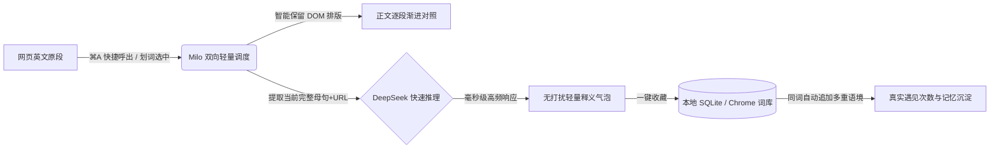
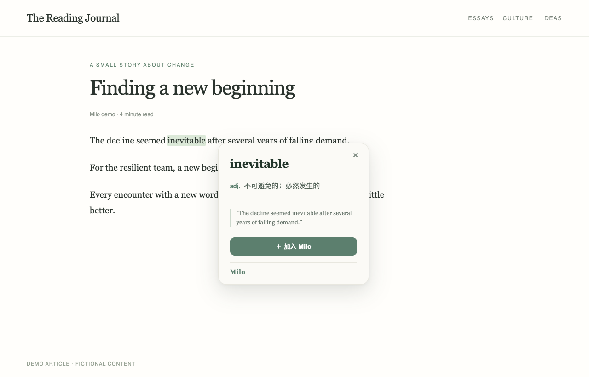
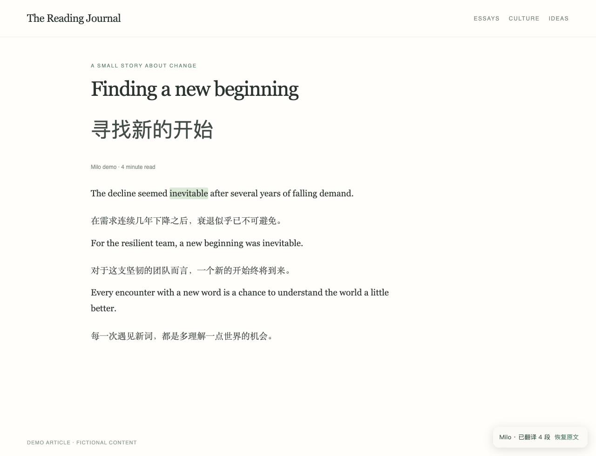

<p align="center"></p>
<h1 align="center">Milo Translator Extension</h1>
<p align="center"><strong>“别人翻译完就结束，Milo 翻译完才刚开始。”</strong></p>
<p align="center">面向沉浸式英文阅读的 AI 原生渐进式双语对照 · 上下文生词捕获 · 桌面端轻量伴读系统</p>
<p align="center">
  <a href="https://github.com/libuyi543-lang/milo-browser-extension/releases/latest">下载安装包</a> ·
  <a href="docs/INSTALL.md">安装教程</a> ·
  <a href="README.en.md">English README</a> ·
  <a href="https://github.com/libuyi543-lang/milo-browser-extension/issues">反馈建议</a>
</p>
<p align="center">
  <a href="https://github.com/libuyi543-lang/milo-browser-extension/actions/workflows/build.yml"></a>
  
  
  
  <a href="LICENSE"></a>
</p>


读英文长文、看 X/Twitter 推文时，遇见一个陌生词：**选中 → 看释义 → 加入 Milo**。原句、网页标题、URL 和遇见时间自动归档留存。下一次在新的网页再次保存同一个词，Milo 会自动追加新的上下文语境，并递增「遇见次数」。

> 💡 **产品定位**：Milo Translator Extension 是 Milo 词库生态的桌面浏览器入口。告别传统工具查完即走的断裂体验，打造**“沉浸双语阅读 ➔ 语境生词捕获 ➔ 认知沉淀”**的完整心流闭环。

---

## 💡 为什么做 Milo Translator？

在深度阅读外文资料、论文、推特技术流时，传统的翻译与查词工具往往存在三大核心痛点：



1. **阅读流被打断（Broken Flow）**：传统词典弹窗厚重繁琐；通篇机翻又失去英文语感。Milo 采用**“原句下插入中文”的渐进式对照**，保留原文排版呼吸感，按快捷键一键唤醒与还原；
2. **生词脱离语境（Context Blind）**：死记词汇表极难维持长期记忆。Milo 坚持**“让每个词都带着当时的句子被留下”**，记录出处与场景；
3. **高频低成本自动化（杰文斯悖论）**：原生接入 DeepSeek 高速模型，配合本地 LRU 缓存与请求防抖合流，将翻译与查词的试错成本降到极低。

---

## ✨ 核心功能与使用体验

### 01 · 划词，然后把语境一起留下



- **毫秒级悬浮窗**：轻量浮窗精准包含词性、中文精准释义与原始母句；
- **一键加入生词本**：保存的不仅是死板的词条，而是你第一次在真实世界与它相遇的场景。

### 02 · 渐进式双语：中文就在英文下面



- **沉浸式段落对照**：Mac 按 **⌘ A**，Windows 按 **Ctrl+A**，即可在英文段落下方直接展开中文对照；再按一次立即无痕恢复。输入框和代码编辑器内依然保留原生全选功能；
- **针对信息流深度优化**：在 **X / Twitter** 上，专精识别主内容推文、回复与文章，智能过滤多余的侧边栏、账号标签、交互计数等噪音元素。

### 03 · 每一次遇见，都算数


- **智能去重与语境追加**：工具栏弹窗直观查看已收录词汇与复现频次。再次收藏同一个词汇不会产生重复条目，而是追加新的语境切片（Encounter），助你在不同场景下真正掌握核心词义。

> 📌 *上述界面图示均由 Milo UI 在真实测试环境下渲染，使用本地 fixtures，不泄露任何用户私有数据或密钥。*

---

## ⚡ 三分钟快速开始

1. 从 [Releases 页面](https://github.com/libuyi543-lang/milo-browser-extension/releases/latest) 下载最新 ZIP 安装包并解压；
2. 打开 Chrome（或 Edge、Brave 等 Chromium 浏览器），在地址栏输入 `chrome://extensions`；
3. 打开右上角**「开发者模式」**，点击左上角**「加载已解压的扩展程序」**，选择刚才解压的目录；
4. 点击浏览器工具栏的 Milo 图标，填入你的 **DeepSeek API Key** 并保存；
5. 在任意英文网页中划选单词，或使用快捷键开启你的双语阅读之旅！

> 完整安装步骤与常见排错见 [安装指南 (INSTALL.md)](docs/INSTALL.md)。

---

## 🛠️ 系统架构与性能设计

| 关键机制 | 工程实现与优化策略 | 用户价值 |
| :--- | :--- | :--- |
| **多级本地缓存** | 单词缓存 30 天，长正文缓存 7 天（上限 500 条 / 约 1MB） | 瞬间命中，零网络等待，极大降低 API 费用 |
| **去重与并发合并** | 相同未完成请求复用 Promise，最多允许 2 个并发任务，划词任务享受最高优先权 | 杜绝并发堵塞与重复计费 |
| **智能防抖调度** | 划词稳定停顿 150ms 后才触发请求；关闭弹窗或切换即刻中断未完成网络流 | 有效消除划选误触与无效请求 |
| **视口优先渲染** | 优先处理当前屏幕视口（Viewport）内的段落，长文自动流式拆分 | 几千字长文章随看随翻，阅读不卡顿 |

---

## 🔒 隐私与安全性保障

- **密钥本地自持**：API Key 严格保存在本地 `chrome.storage.local`，网页宿主脚本（Content Script）无权限直接访问；
- **纯粹点对点请求**：翻译与查词直连 `api.deepseek.com`，不经过任何第三方私有中转服务器；
- **无追踪、无收集**：Milo 不会收集或上传你的浏览历史、网页 URL、个人收藏词库或私人隐私。

---

## 🗺️ 当前可用与后续路线

| 功能模块 | 当前版本状态 | 后续演进计划 |
| :--- | :--- | :--- |
| **单词与语境** | ✅ 英文划词、释义、原句抓取、遇见计数 | 🔄 移动端 / 微信小程序无缝双向同步 |
| **网页阅读** | ✅ 快捷键逐段中英对照、恢复、X/Twitter 适配 | 🔄 导出为 Anki 格式 (.apkg / .csv) |
| **模型调度** | ✅ DeepSeek Flash 高速接口与统一适配层 | 🔄 接入更多开源与商用兼容 LLM 提供商 |

---

## 💻 本地工程开发

本项目基于 Chrome Manifest V3 规范构建，采用 React / TypeScript、RxJS 划词流与 Neutrino / Webpack 扩展基础设施：

```sh
# 克隆仓库
git clone https://github.com/libuyi543-lang/milo-browser-extension.git
cd milo-browser-extension

# 安装依赖与构建 (推荐 Node 16.20.2 + Yarn 1.22.22)
corepack enable
corepack prepare yarn@1.22.22 --activate
yarn install --frozen-lockfile

# 运行自动化测试与打包
yarn test
yarn build
yarn package
```

---

## 🤝 交流与致谢

- 如果 Milo 帮助你在日常外文阅读中留下了原本会忘掉的生词，欢迎在 GitHub 点个 ⭐️ **Star** 鼓励！
- 欢迎通过 [Issue](https://github.com/libuyi543-lang/milo-browser-extension/issues) 反馈正文识别、语境提取与功能提议。
- 部分基础模块参考或使用了 [Saladict](https://github.com/crimx/ext-saladict) 的工程实践，感谢原作者及开源社区。详细许可与版权见 [LICENSE](LICENSE) 与 [NOTICE.md](NOTICE.md)。
