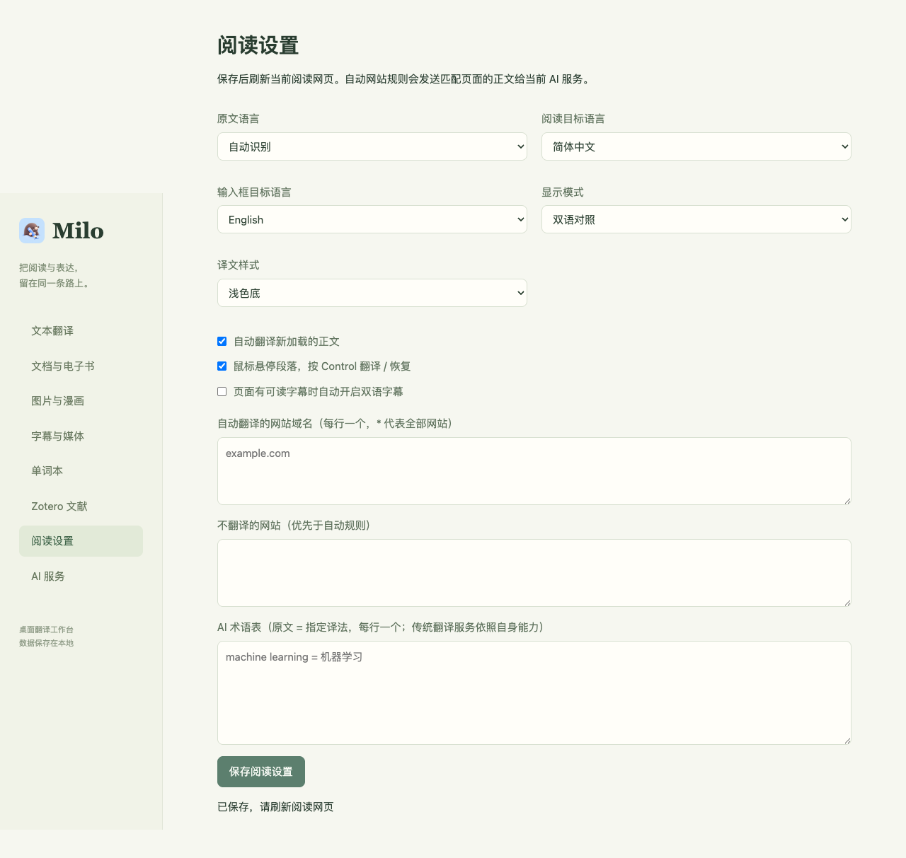
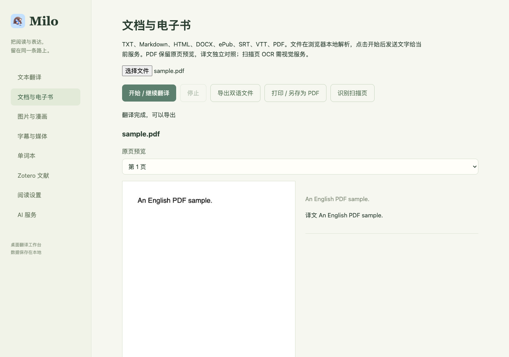

# Milo 桌面功能 · V0.5.0

本版集中于桌面 Chrome / Chromium 扩展，不包含手机端、登录同步或在线会议翻译。没有承诺与沉浸式翻译商业版完全等价。

## 入口

- 工具栏 Milo → **工具与阅读设置**：打开工作台。
- 网页 `⌘A` / `Ctrl+A` 或 `Alt+Shift+Y`：翻译 / 恢复正文；编辑器保留原生全选。
- 鼠标悬停正文段落后按 Control：翻译 / 恢复这一段。
- `Alt+Shift+M`：工作台；`Alt+Shift+O` 或页面右键 Milo：圈选区域。
- 输入框连续敲三下空格：原位翻译，目标语言默认英文，可在阅读设置调整。
- 快捷键冲突可在 `chrome://extensions/shortcuts` 调整。

## 已实现与边界

| 功能 | 本版实现 | 使用边界 |
| --- | --- | --- |
| 划词与语境 | 英文词释义、音标、浏览器朗读、原句、收藏与重复遇见计数；短语 / 其他文字用文本浮窗 | 单词本仍以英文词条为主；浏览器语音是否可用取决于系统 |
| 正文阅读 | 双语 / 仅译文、四种样式、视口优先、新加载正文自动续译、修改内容去重 | 通用正文识别有站点差异；X 只取主内容，复杂 Canvas 不直接改写 |
| 阅读偏好 | 100 多种目标语言选项、源语言、自动 / 排除域名、AI 术语表 | 实际语言能力受所选服务限制；自动规则默认为空，排除优先；传统服务不支持自定义 AI 术语提示 |
| 服务 | DeepSeek / 智谱 / 小米 / MiniMax、自定义兼容 API、DeepL / Google Cloud / Microsoft | 自备密钥；自定义端点需兼容 Chat Completions；不附赠账户额度 |
| 文本工具 | 手动文本翻译、复制、源语言和目标语言设置 | 单次 6500 字符 |
| 文件 | TXT、Markdown、HTML、DOCX、ePub、PDF、SRT、VTT 本地读取、分段翻译、停止 / 继续、导出 | 单文件 30 MB，PDF 100 页，6000 段；DOCX/ePub 保留原资源追加译文，未覆盖全部复杂排版 |
| PDF | PDF.js 本地提取 / 渲染；扫描页用 DeepSeek Flash OCR；导出原页 + 译文对照 HTML，可打印为 PDF | 原页图像保留图表公式；不是原 PDF 的逐行重排；扫描 OCR 需视觉 API，仍可能识别错误 |
| 图片 / 漫画 | 批量最多 30 张、本地缩放、OCR 区域与译文编辑、覆盖 PNG / 文本导出、网页右键图片与圈选 | DeepSeek Flash / MiMo Flash / MiniMax M3 视觉模型；覆盖使用采样底色，不是背景修复；受保护图片可先保存本地 |
| 视频字幕 | 原生 TextTrack、YouTube / Netflix / Prime 可读 DOM 字幕适配；双语覆盖层 | 依赖页面提供可读字幕；未宣称所有视频平台测试通过，付费 / DRM 内容可能受限 |
| 字幕文件 | SRT / VTT 翻译导出，时间轴保留，可配合本地媒体预览 | 保留原时间轴，不做自动字级对齐 |
| 本地音频 | MiMo 转录 → 当前翻译服务 → 字幕导出 | 40 MB / 30 分钟，15 秒分段、粗粒度时间轴；视频文件仅用于字幕播放预览 |
| 无字幕标签页音频 | 视频网页右键 Milo 音频翻译，用户主动授权的标签页采集 → MiMo → 翻译 → 页面字幕 | 约 8 秒分段 + 网络延迟；不访问麦克风，不含会议适配；30 分钟上限，积压超过两段跳过旧段；尚未完成真实账户与所有平台采集实测 |
| Google Docs | 在自己的文档右键导出 DOCX，打开本地工作台后手动翻译 | 使用当前 Google 登录权限；失败可从文件菜单下载再导入；不修改在线文档 |
| Zotero | 连接本机只读 API、读取附件索引文字、翻译 / 导出 | 需开启本机通信，已有全文索引；不修改库、不直接替换附件；未使用个人 Zotero 库实测 |
| 单词本 | 搜索、查看全部 encounters、JSON 备份 / 合并恢复、CSV / Anki 导入格式、删除 / 撤销 | CSV 可在 Anki 导入并映射字段，不生成 .apkg；无手机同步，更新时避免卸载 |

以上配图使用隔离浏览器与本地示例，AI 响应为模拟数据。

## 效率与费用

文字翻译继续复用缓存、请求合并和最多两路并发。关闭工具、停止任务或修改配置会取消未完成请求。正文更新只处理变更内容；页面恢复时断开监听并还原原文。源 / 目标语言、上下文、术语表和服务配置参与缓存隔离。

图片与音频没有永久结果缓存。只有明确点击识别 / 翻译时上传；音频按段计费，扫描 PDF 按页调用视觉模型。API 失败或识别质量应先用少量材料验证，费用以服务账户账单为准。

## 验证记录

- Lint、TypeScript、164 项自动测试：协议、配置、缓存、取消、段落恢复、文件导出、OCR 数据验证、词库备份等。
- 隔离 Chromium：动态正文、悬停、仅译文恢复、100 多语言选项、DOCX / ePub / SRT 导出、真实 PDF.js 提取和渲染、模拟 OCR 与 PNG 导出、可读视频字幕、圈选截图、词库备份和撤销。
- 原有输入框三空格与工具栏弹窗另有浏览器回归脚本。
- 未以真实 API 请求替代模拟响应；账户授权、计费、在线 Google Docs / Zotero、实际标签页音频采集和各平台 DRM 兼容需在对应环境验证。

## 参考

功能参照 [沉浸式翻译桌面介绍](https://immersivetranslate.com/zh-Hans/)。接口依据见 [服务配置](AI_PROVIDERS.md)，数据与权限见 [隐私说明](../PRIVACY.md)。
